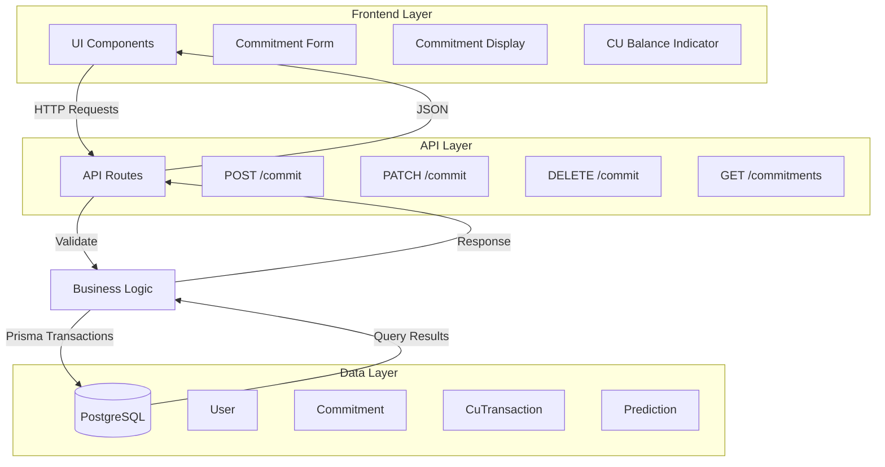

# Design Document: Prediction Commitment

## Overview

The prediction commitment system enables users to stake Confidence Units (CU) on prediction outcomes, creating a reputation-based forecasting mechanism. This design extends the existing commitment infrastructure (database models, basic API endpoints) with a complete user-facing feature including UI components, enhanced API endpoints, and proper transaction handling.

### Key Design Principles

1. **Atomic Operations**: All CU movements must be atomic to prevent balance inconsistencies
2. **Immutable Ledger**: Transaction history provides complete audit trail
3. **Optimistic Locking**: Prevent race conditions in concurrent commitment operations
4. **Separation of Concerns**: API layer handles business logic, UI components handle presentation
5. **Type Safety**: Leverage TypeScript and Zod for compile-time and runtime validation

### Existing Infrastructure

The following models and basic endpoints already exist:
- Database: `Commitment`, `CuTransaction`, `User` (with `cuAvailable`, `cuLocked`, `rs`)
- API: `POST /api/predictions/[id]/commit` (create), `DELETE /api/predictions/[id]/commit` (remove)
- Validation: `createCommitmentSchema` in `src/lib/validations/prediction.ts`

This design focuses on completing the feature with update functionality, UI components, and proper integration.

## Architecture

### System Components



### Request Flow

**Create Commitment Flow:**
1. User submits commitment form (outcome + CU amount)
2. Client validates input and sends POST to `/api/predictions/[id]/commit`
3. API validates request with Zod schema
4. Business logic checks: user auth, prediction status, CU availability, no existing commitment
5. Atomic transaction: create commitment, update user CU balances, create ledger entry, lock prediction if first
6. Return commitment with updated user balances
7. UI updates to show commitment and new CU balance

**Update Commitment Flow:**
1. User modifies commitment form (change outcome or CU amount)
2. Client sends PATCH to `/api/predictions/[id]/commit`
3. API validates request and checks prediction is still active
4. Calculate CU delta (new amount - old amount)
5. Atomic transaction: update commitment, adjust user CU balances, create ledger entries for adjustment
6. Return updated commitment
7. UI reflects changes

**Remove Commitment Flow:**
1. User clicks "Withdraw Commitment"
2. Client sends DELETE to `/api/predictions/[id]/commit`
3. API validates prediction is still active
4. Atomic transaction: delete commitment, refund CU, create refund ledger entry
5. Return success
6. UI shows commitment form again

## Components and Interfaces

### API Endpoints

#### POST /api/predictions/[id]/commit
**Status:** Implemented (existing)

Creates a new commitment for the authenticated user.

**Request Body:**
```typescript
{
  cuCommitted: number,      // 1-1000
  binaryChoice?: boolean,   // Required for binary predictions
  optionId?: string         // Required for multiple choice
}
```

**Response:** `201 Created`
```typescript
{
  id: string,
  userId: string,
  predictionId: string,
  cuCommitted: number,
  binaryChoice?: boolean,
  optionId?: string,
  rsSnapshot: number,
  createdAt: string,
  user: { id, name, username, image },
  option?: { id, text }
}
```

**Errors:**
- `401 Unauthorized`: Not authenticated
- `400 Bad Request`: Validation failed, insufficient CU, already committed, prediction not active
- `404 Not Found`: Prediction not found

#### PATCH /api/predictions/[id]/commit
**Status:** New endpoint needed

Updates an existing commitment for the authenticated user.

**Request Body:**
```typescript
{
  cuCommitted?: number,     // New CU amount (1-1000)
  binaryChoice?: boolean,   // New binary choice
  optionId?: string         // New option selection
}
```

**Validation Rules:**
- At least one field must be provided
- If changing outcome (binaryChoice or optionId), must provide valid value
- If changing CU amount, must have sufficient available CU for increase
- Must own the commitment
- Prediction must be ACTIVE

**Response:** `200 OK`
```typescript
{
  id: string,
  userId: string,
  predictionId: string,
  cuCommitted: number,
  binaryChoice?: boolean,
  optionId?: string,
  rsSnapshot: number,
  createdAt: string,
  user: { id, name, username, image },
  option?: { id, text }
}
```

**Errors:**
- `401 Unauthorized`: Not authenticated
- `400 Bad Request`: Validation failed, insufficient CU, prediction not active
- `404 Not Found`: Commitment not found

#### DELETE /api/predictions/[id]/commit
**Status:** Implemented (existing)

Removes a commitment and refunds CU.

**Response:** `200 OK`
```typescript
{ success: true }
```

**Errors:**
- `401 Unauthorized`: Not authenticated
- `400 Bad Request`: Prediction not active
- `404 Not Found`: Commitment not found

#### GET /api/commitments
**Status:** New endpoint needed

Lists commitments for the authenticated user.

**Query Parameters:**
```typescript
{
  predictionId?: string,    // Filter by prediction
  status?: string,          // Filter by prediction status
  page?: number,            // Default: 1
  limit?: number            // Default: 20, max: 100
}
```

**Response:** `200 OK`
```typescript
{
  commitments: Array<{
    id: string,
    predictionId: string,
    cuCommitted: number,
    binaryChoice?: boolean,
    optionId?: string,
    rsSnapshot: number,
    createdAt: string,
    cuReturned?: number,
    rsChange?: number,
    prediction: {
      id: string,
      claimText: string,
      status: string,
      resolveByDatetime: string,
      outcomeType: string
    },
    option?: { id, text }
  }>,
  pagination: {
    page: number,
    limit: number,
    total: number,
    totalPages: number
  }
}
```

### UI Components

#### CommitmentForm Component
**Location:** `src/components/predictions/CommitmentForm.tsx`

**Purpose:** Allow users to create or update commitments

**Props:**
```typescript
interface CommitmentFormProps {
  prediction: Prediction
  existingCommitment?: Commitment
  userCuAvailable: number
  onSuccess: (commitment: Commitment) => void
  onCancel?: () => void
}
```

**State:**
- `cuAmount: number` - Amount to commit (1 to userCuAvailable)
- `selectedOutcome: string | boolean` - Selected option ID or binary choice
- `isSubmitting: boolean` - Loading state
- `error: string | null` - Error message

**Behavior:**
- For binary predictions: Show "Will Happen" / "Won't Happen" toggle
- For multiple choice: Show radio buttons for each option
- Show CU slider/input (1 to available CU)
- Disable submit if no outcome selected or CU < 1
- On submit: Call appropriate API endpoint (POST for new, PATCH for update)
- Show loading state during submission
- Display error messages from API
- Call onSuccess callback with result

**Validation:**
- CU amount must be integer between 1 and userCuAvailable
- Must select an outcome
- Show real-time validation feedback

#### CommitmentDisplay Component
**Location:** `src/components/predictions/CommitmentDisplay.tsx`

**Purpose:** Show user's existing commitment on a prediction

**Props:**
```typescript
interface CommitmentDisplayProps {
  commitment: Commitment
  prediction: Prediction
  onEdit?: () => void
  onRemove?: () => void
}
```

**Display:**
- Committed CU amount
- Selected outcome (option text or "Will Happen"/"Won't Happen")
- Commitment timestamp
- If resolved: CU returned, RS change (with +/- indicator)
- Edit button (if prediction is ACTIVE)
- Remove button (if prediction is ACTIVE)

**Behavior:**
- Edit button opens CommitmentForm in update mode
- Remove button shows confirmation dialog, then calls DELETE endpoint
- Show resolved state with outcome indicators (green for gain, red for loss)

#### CUBalanceIndicator Component
**Location:** `src/components/predictions/CUBalanceIndicator.tsx`

**Purpose:** Display user's CU balance

**Props:**
```typescript
interface CUBalanceIndicatorProps {
  cuAvailable: number
  cuLocked: number
  showDetails?: boolean
}
```

**Display:**
- Available CU (prominent)
- Locked CU (secondary)
- Total CU (if showDetails)
- Visual indicator (progress bar or icon)

**Styling:**
- Green for healthy balance (>50 CU available)
- Yellow for low balance (10-50 CU available)
- Red for very low balance (<10 CU available)

### Validation Schemas

#### Update Commitment Schema
**Location:** `src/lib/validations/prediction.ts`

```typescript
export const updateCommitmentSchema = z.object({
  cuCommitted: z.number().int().min(1).max(1000).optional(),
  binaryChoice: z.boolean().optional(),
  optionId: z.string().cuid().optional(),
}).refine(
  (data) => Object.keys(data).length > 0,
  { message: 'Must provide at least one field to update' }
).refine(
  (data) => {
    // If updating outcome, must provide valid value
    const hasOutcomeChange = data.binaryChoice !== undefined || data.optionId !== undefined
    if (hasOutcomeChange) {
      return data.binaryChoice !== undefined || data.optionId !== undefined
    }
    return true
  },
  { message: 'Must specify either binaryChoice or optionId when changing outcome' }
)
```

#### List Commitments Query Schema
**Location:** `src/lib/validations/prediction.ts`

```typescript
export const listCommitmentsQuerySchema = z.object({
  predictionId: z.string().cuid().optional(),
  status: z.enum(['ACTIVE', 'PENDING', 'RESOLVED_CORRECT', 'RESOLVED_WRONG', 'VOID', 'UNRESOLVABLE']).optional(),
  page: z.coerce.number().int().min(1).default(1),
  limit: z.coerce.number().int().min(1).max(100).default(20),
})
```

## Data Models

The data models already exist in the Prisma schema. Key relationships:

**User ↔ Commitment (1:N)**
- User has many commitments
- Each commitment belongs to one user
- User tracks cuAvailable and cuLocked

**Prediction ↔ Commitment (1:N)**
- Prediction has many commitments
- Each commitment belongs to one prediction
- Unique constraint: (userId, predictionId)

**Commitment ↔ PredictionOption (N:1)**
- Commitment may reference one option (for multiple choice)
- Option can have many commitments

**User ↔ CuTransaction (1:N)**
- User has many transactions
- Each transaction belongs to one user
- Transactions form immutable ledger

### Transaction Ledger Entries

**COMMITMENT_LOCK** (when creating commitment):
```typescript
{
  userId: string,
  type: 'COMMITMENT_LOCK',
  amount: -cuCommitted,           // Negative (debit)
  referenceId: commitmentId,
  note: 'Committed to prediction: [claim text]',
  balanceAfter: cuAvailable - cuCommitted
}
```

**COMMITMENT_UNLOCK** (when prediction resolves):
```typescript
{
  userId: string,
  type: 'COMMITMENT_UNLOCK',
  amount: cuReturned,             // Positive (credit)
  referenceId: commitmentId,
  note: 'Prediction resolved: [outcome]',
  balanceAfter: cuAvailable + cuReturned
}
```

**REFUND** (when removing commitment or prediction voided):
```typescript
{
  userId: string,
  type: 'REFUND',
  amount: cuCommitted,            // Positive (credit)
  referenceId: commitmentId,
  note: 'Commitment withdrawn' | 'Prediction voided',
  balanceAfter: cuAvailable + cuCommitted
}
```

**Update Commitment Transactions** (when changing CU amount):
- If increasing: COMMITMENT_LOCK for additional amount
- If decreasing: REFUND for returned amount


## Correctness Properties

*A property is a characteristic or behavior that should hold true across all valid executions of a system—essentially, a formal statement about what the system should do. Properties serve as the bridge between human-readable specifications and machine-verifiable correctness guarantees.*

### Property 1: Binary Commitment Validation
*For any* binary prediction and any commitment request, the system should accept the commitment if and only if it includes a boolean binaryChoice and a CU amount between 1 and the user's available CU.

**Validates: Requirements 1.1, 8.1, 8.2**

### Property 2: Multiple Choice Commitment Validation
*For any* multiple choice prediction and any commitment request, the system should accept the commitment if and only if it includes a valid optionId for that prediction and a CU amount between 1 and the user's available CU.

**Validates: Requirements 1.2, 8.1, 8.3**

### Property 3: Commitment Creation Atomicity
*For any* valid commitment creation, all four operations must succeed together: (1) user's cuAvailable decreases by cuCommitted, (2) user's cuLocked increases by cuCommitted, (3) a commitment record is created, and (4) a COMMITMENT_LOCK transaction is created with amount = -cuCommitted.

**Validates: Requirements 1.3, 7.1, 10.1**

### Property 4: RS Snapshot on Commitment
*For any* commitment creation or update, the rsSnapshot field should equal the user's current RS at the time of the operation.

**Validates: Requirements 1.4, 3.5**

### Property 5: First Commitment Locks Prediction
*For any* prediction with zero commitments, creating the first commitment should set the prediction's lockedAt timestamp, and for predictions with existing commitments, adding another should not change lockedAt.

**Validates: Requirements 1.5**

### Property 6: Commitment Authorization Rules
*For any* commitment creation attempt, the system should reject if: (1) the user is the prediction author, (2) the prediction status is not ACTIVE, or (3) the requested CU exceeds the user's available CU.

**Validates: Requirements 1.6, 1.7, 1.8, 8.4**

### Property 7: Commitment Update Atomicity
*For any* commitment update that changes the CU amount, the system should atomically: (1) adjust cuAvailable and cuLocked by the delta, (2) update the commitment record, and (3) create appropriate transaction ledger entries (COMMITMENT_LOCK for increases, REFUND for decreases).

**Validates: Requirements 3.2, 3.3, 10.2**

### Property 8: Update Authorization
*For any* commitment update or removal attempt, the system should reject if: (1) the prediction status is not ACTIVE, or (2) the commitment doesn't exist or doesn't belong to the requesting user.

**Validates: Requirements 3.4, 4.2, 8.6**

### Property 9: Commitment Removal Atomicity
*For any* commitment removal, the system should atomically: (1) delete the commitment record, (2) increase cuAvailable by cuCommitted, (3) decrease cuLocked by cuCommitted, and (4) create a REFUND transaction with amount = cuCommitted.

**Validates: Requirements 4.1, 4.3, 7.3, 10.3**

### Property 10: CU Balance Invariant
*For any* user at any point in time, the sum of cuAvailable and cuLocked should equal the sum of all positive transaction amounts minus the sum of all negative transaction amounts.

**Validates: Requirements 5.3, 7.5**

### Property 11: Resolution Correctness Determination
*For any* resolved binary prediction, commitments with binaryChoice=true should be marked correct if resolutionOutcome='correct', and commitments with binaryChoice=false should be marked correct if resolutionOutcome='wrong'. For multiple choice predictions, only commitments with optionId matching the correctOptionId should be marked correct.

**Validates: Requirements 6.1, 6.7, 6.8, 6.9**

### Property 12: Resolution CU Return
*For any* resolved prediction (regardless of outcome), all commitments should have their cuCommitted returned to the user's cuAvailable balance, and cuLocked should decrease by the same amount.

**Validates: Requirements 6.2**

### Property 13: Resolution RS Adjustment
*For any* prediction resolved as 'correct' or 'wrong', commitments marked as correct should increase the user's RS, and commitments marked as incorrect should decrease the user's RS. For predictions resolved as 'void' or 'unresolvable', no RS changes should occur.

**Validates: Requirements 6.3, 6.4, 6.5**

### Property 14: Resolution Atomicity
*For any* commitment resolution, the system should atomically: (1) update the commitment record with cuReturned and rsChange, (2) update the user's cuAvailable, cuLocked, and rs, and (3) create a COMMITMENT_UNLOCK or REFUND transaction.

**Validates: Requirements 6.6, 10.4, 10.5**

### Property 15: Transaction Ledger Completeness
*For any* user, the transaction ledger should contain entries for: (1) INITIAL_GRANT on signup, (2) COMMITMENT_LOCK for each commitment creation, (3) COMMITMENT_UNLOCK for each resolution, and (4) REFUND for each removal or void. All transactions should have type, amount, referenceId, note, and balanceAfter fields populated.

**Validates: Requirements 7.4, 7.5**

### Property 16: Transaction Ordering
*For any* user's transaction history query, transactions should be returned in reverse chronological order (newest first).

**Validates: Requirements 7.6**

### Property 17: Duplicate Commitment Prevention
*For any* user and prediction pair, attempting to create a second commitment should be rejected if a commitment already exists.

**Validates: Requirements 8.5**

### Property 18: Prediction List Statistics
*For any* prediction displayed in a list, the total commitment count should equal the number of commitment records, and the total CU committed should equal the sum of all commitments' cuCommitted values.

**Validates: Requirements 9.1, 9.2**

### Property 19: Commitment Display Completeness
*For any* commitment displayed in the UI, the rendered output should include: (1) cuCommitted amount, (2) selected outcome (option text or binary choice), (3) commitment timestamp, and (4) if resolved, cuReturned and rsChange values.

**Validates: Requirements 2.1, 2.3, 2.4, 5.1**

## Error Handling

### API Error Responses

All API endpoints follow consistent error response format:

```typescript
{
  error: string,           // Human-readable error message
  details?: unknown        // Optional validation details (Zod errors)
}
```

### Error Categories

**Authentication Errors (401)**
- Missing or invalid session
- Expired token

**Authorization Errors (403)**
- Attempting to modify another user's commitment
- Non-moderator attempting to resolve prediction

**Validation Errors (400)**
- Invalid request body (Zod validation failure)
- Business rule violations:
  - Insufficient CU
  - Prediction not in correct status
  - Invalid option selection
  - Duplicate commitment
  - CU amount out of range

**Not Found Errors (404)**
- Prediction doesn't exist
- Commitment doesn't exist
- User doesn't exist

**Server Errors (500)**
- Database transaction failures
- Unexpected errors

### Transaction Rollback

All commitment operations use Prisma transactions with automatic rollback:

```typescript
await prisma.$transaction(async (tx) => {
  // All operations here
  // If any operation throws, entire transaction rolls back
})
```

### Idempotency Considerations

- **Create Commitment**: Not idempotent (unique constraint prevents duplicates)
- **Update Commitment**: Idempotent (same update applied multiple times has same effect)
- **Delete Commitment**: Idempotent (deleting non-existent commitment returns 404, but safe)
- **Resolution**: Not idempotent (should only be called once per prediction)

## Testing Strategy

### Dual Testing Approach

This feature requires both unit tests and property-based tests for comprehensive coverage:

**Unit Tests** focus on:
- Specific examples of commitment creation, update, removal
- Edge cases (CU = 1, CU = max available, first commitment on prediction)
- Error conditions (insufficient CU, invalid prediction status, unauthorized access)
- Integration between API routes and database
- UI component rendering with specific props

**Property-Based Tests** focus on:
- Universal properties that hold for all inputs
- Comprehensive input coverage through randomization
- Invariants (CU balance consistency, transaction ledger completeness)
- Atomicity guarantees across concurrent operations

### Property-Based Testing Configuration

**Framework**: Use `fast-check` for TypeScript property-based testing

**Configuration**:
- Minimum 100 iterations per property test
- Each test must reference its design document property
- Tag format: `// Feature: prediction-commitment, Property N: [property text]`

**Example Property Test Structure**:

```typescript
import fc from 'fast-check'
import { describe, it, expect } from 'vitest'

describe('Commitment Creation Atomicity', () => {
  it('should atomically update all related records', async () => {
    // Feature: prediction-commitment, Property 3: Commitment Creation Atomicity
    
    await fc.assert(
      fc.asyncProperty(
        fc.record({
          cuCommitted: fc.integer({ min: 1, max: 100 }),
          binaryChoice: fc.boolean(),
        }),
        async (commitmentData) => {
          // Setup: Create user with known CU balance
          // Execute: Create commitment
          // Verify: All four operations succeeded together
        }
      ),
      { numRuns: 100 }
    )
  })
})
```

### Test Data Generators

Property tests require generators for:
- **Users**: Random cuAvailable (1-1000), cuLocked (0-500), rs (50-150)
- **Predictions**: Random outcomeType, status, options (for MC)
- **Commitments**: Random cuCommitted (1-user's available), random outcome selection
- **Transactions**: Verify generated from operations, not created directly

### Integration Testing

**API Route Tests**:
- Test each endpoint with valid and invalid inputs
- Verify HTTP status codes and response formats
- Test authentication and authorization
- Test concurrent requests (race conditions)

**UI Component Tests**:
- Test rendering with various prop combinations
- Test user interactions (form submission, button clicks)
- Test error display
- Test loading states

### Manual Testing Checklist

- [ ] Create commitment on binary prediction
- [ ] Create commitment on multiple choice prediction
- [ ] Update commitment (change outcome)
- [ ] Update commitment (change CU amount)
- [ ] Remove commitment
- [ ] Verify CU balance updates in real-time
- [ ] Verify transaction history shows all operations
- [ ] Test with insufficient CU
- [ ] Test committing to own prediction (should fail)
- [ ] Test committing to non-active prediction (should fail)
- [ ] Verify first commitment locks prediction
- [ ] Verify commitment display after resolution
- [ ] Test concurrent commitments on same prediction
