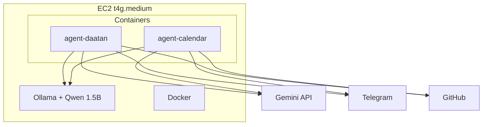

# OpenClaw EC2 Deployment Plan

Deploy The Clawborators on a t4g.medium EC2 instance for Daatan and Calendar projects. Mixed Gemini + local Qwen fallback, best-practice personalities, full create/destroy workflow.

---

## Current State

The [infra/openclaw/](.) directory contains:

- **Terraform**: [main.tf](terraform/main.tf), [variables.tf](terraform/variables.tf), [outputs.tf](terraform/outputs.tf)
- **Docker Compose**: [docker-compose.yml](docker-compose.yml) with `agent-daatan` and `agent-calendar`
- **Configs**: [config/daatan.json](config/daatan.json), [config/calendar.json](config/calendar.json)

---

## Refined Configuration (OpenClaw Official Schema)

### Models and Fallback

- Use `fallbacks` (array), not `fallback` (string): `"fallbacks": ["ollama/qwen:1.5b"]`
- Primary: `google/gemini-1.5-pro` (main/devops), `google/gemini-1.5-flash` (QA)
- Optional upgrade: `ollama/phi4-mini` (better reasoning, ~2.5GB RAM) if instance has headroom

### Ollama Provider (Critical)

Per [OpenClaw Ollama docs](https://www.getopenclaw.ai/help/ollama-local-models-setup):

```json
"ollama": {
  "baseUrl": "http://host.docker.internal:11434/v1",
  "apiKey": "ollama-local",
  "api": "openai-responses"
}
```

- `baseUrl` (camelCase) must end with `/v1`; `api` is required or models return 0 tokens.

### Channels (Telegram)

Add `channels.telegram` with `botToken` and `chatId` from env:

```json
"channels": {
  "telegram": {
    "enabled": true,
    "botToken": "${TELEGRAM_BOT_TOKEN}",
    "chatId": "${TELEGRAM_CHAT_ID}",
    "dmPolicy": "pairing",
    "streamMode": "partial"
  }
}
```

### Agent Identity

Add per-agent `identity` for personality:

- **Daatan**: Corvus (main), DevOps, QA — each with `name`, `theme`, `emoji`
- **Calendar**: `{ "name": "Calendar Agent", "theme": "Year-shape (Vite, TypeScript)", "emoji": "📅" }`

---

## Environment Variables (Required .env on EC2)

| Variable | Required | Description |
|----------|----------|-------------|
| `GEMINI_API_KEY` | Yes | Google Gemini API key (or `GOOGLE_API_KEY` - check OpenClaw version) |
| `TELEGRAM_BOT_TOKEN` | Yes | From @BotFather |
| `TELEGRAM_CHAT_ID` | Yes | Your Telegram chat ID for DMs/commands. Get via `openclaw telegram info` or `curl https://api.telegram.org/bot$TOKEN/getUpdates` |

GitHub: Uses SSH deploy key (generated on instance). No token needed for clone. Add deploy key to both repos with write access if agents will push.

---

## Personalities (Best-Practice SOUL.md and AGENTS.md)

Per [OpenClaw SOUL template](https://docs.molt.bot/reference/templates/SOUL) and community: keep SOUL under ~15 lines for specialized agents; main agents get full template + project rules. Avoid verbosity, overlapping rules, over-specification.

### Daatan - Corvus (main)

**Keep existing** [agents/corvus/SOUL.md](../../agents/corvus/SOUL.md) - it follows the template (Core Truths, Boundaries, Vibe, Continuity) and has strong DAATAN-specific rules (cost, safety, quiet hours). Optionally trim "Continuity" paragraph if token-budgeting.

### Daatan - DevOps

**Current** [agents/devops/SOUL.md](../../agents/devops/SOUL.md) is role-focused but verbose. Refine to:

```markdown
# SOUL.md - DevOps Agent

I maintain DAATAN infrastructure: Docker, Terraform, GitHub Actions, deployments.

**Style:** Precise, cautious. Prefer `terraform plan` and `npm audit --dry-run` before acting.
**Rule:** Never run `terraform apply`, `deploy.sh`, or prod migrations without explicit approval.
```

**AGENTS.md:** Keep existing; add key files: `terraform/`, `deploy.sh`, `.github/workflows/deploy.yml`, `scripts/`.

### Daatan - QA

**Current** [agents/qa/SOUL.md](../../agents/qa/SOUL.md) is good. Refine to:

```markdown
# SOUL.md - QA Agent

I ensure DAATAN quality: run tests, check health endpoints, report bugs.

**Style:** Meticulous, systematic. Observe and report; do not modify application code.
**Rule:** Bugs go in `bug_reports/` with steps-to-reproduce, expected vs actual.
```

**AGENTS.md:** Keep existing.

### Calendar - Main (new)

Create `calendar-agent-bootstrap/agents/main/SOUL.md`:

```markdown
# SOUL.md - Calendar Agent

I assist with the YearWheel calendar app (Vite, TypeScript, Tailwind). Interactive calendar visualization, Google Calendar integration, i18n.

**Style:** Concise, practical. Same Core Truths as Corvus: helpful without fluff, resourceful before asking, private stays private.
**Safety:** Never output secrets; ask before deploy. Deploy is Cloudflare Pages (see CLOUDFLARE_DEPLOY.md).
**Cost:** Use flash for routine; pro for complex. Fallback to local when quota exhausted.
```

Create `AGENTS.md`:

```markdown
# AGENTS.md - Calendar Agent

**Goal:** Development, testing, and deployment of YearWheel.
**Key files:** `src/`, `vite.config.ts`, `CLOUDFLARE_DEPLOY.md`
**Commands:** `npm run dev`, `npm test`, `npm run build`
**Deploy:** Cloudflare Pages via `wrangler` or GitHub Actions. Do not deploy without approval.
```

---

## Create/Destroy Workflow

**Create:** `cd terraform && terraform init && terraform plan -var="allowed_ssh_cidr=YOUR_IP/32" && terraform apply`

**Destroy:** `terraform destroy` (releases EIP, terminates instance). Optionally add `scripts/destroy-openclaw.sh` that runs destroy with required vars. Document in README.

---

## Setup Script (Clones Both Projects)

Create `scripts/setup-on-ec2.sh` to run **on the EC2 instance** from `~/openclaw` or from a directory containing this `infra/openclaw/` folder (e.g. after `scp -r infra/openclaw ubuntu@<IP>:~/` or cloning daatan).

**Flow:**

1. `export GIT_SSH_COMMAND="ssh -i ~/.ssh/id_github -o IdentitiesOnly=yes"`
2. `mkdir -p ~/openclaw && cd ~/openclaw`
3. `git clone git@github.com:komapc/daatan.git`
4. `git clone git@github.com:komapc/year-shape.git calendar`
5. Copy `calendar-agent-bootstrap/agents/` into `calendar/agents/`
6. Copy `config/`, `docker-compose.yml` to `~/openclaw/` (from infra/openclaw)
7. Assert `.env` exists with required vars; else prompt user
8. `docker compose up -d`

User: SSH in, add deploy key to GitHub, scp infra/openclaw to EC2, run script from that dir.

---

## Fixes Required

### 1. Terraform User Data - Ollama systemd override

The heredoc in [main.tf](terraform/main.tf) writes leading whitespace into the override file. Systemd override files must not have indentation before `[Service]` or `Environment`. Use heredoc that outputs no leading whitespace.

### 2. Docker Compose - SSH volume paths

[docker-compose.yml](docker-compose.yml) uses `~/.ssh/id_github`. On EC2, Docker Compose may not expand `~` to `/home/ubuntu`. Use absolute paths: `/home/ubuntu/.ssh/id_github`.

### 3. Terraform - allowed_account_ids

Add `allowed_account_ids = ["272007598366"]` to match main project if using same AWS account.

### 4. Terraform - tfvars.example

Add `terraform.tfvars.example` with placeholders for `allowed_ssh_cidr` and `ssh_key_name`.

### 5. Terraform User Data - Ollama pull

`ollama pull qwen:1.5b &` may finish after boot. Run synchronously with timeout, or add systemd oneshot.

### 6. Terraform - Subnet

Add explicit `subnet_id` via `aws_default_subnet` or variable (default VPC assumption is fragile).

### 7. OpenClaw Docker image tag

Use `ghcr.io/openclaw/openclaw:main` or `alpine/openclaw:main`; verify tag exists.

## Config Updates (daatan.json, calendar.json)

- Replace `fallback` with `fallbacks: ["ollama/qwen:1.5b"]`
- Use `baseUrl`, `api`, `apiKey` for Ollama (not `base_url`; add `api: "openai-responses"`)
- Add `channels.telegram` with `botToken`, `chatId` (from TELEGRAM_CHAT_ID)
- Add `identity` per agent (name, theme, emoji)
- **calendar.json:** Use only `main` agent (remove `qa`); add `paths.base: "./agents/main"` for main

## Missing Artifacts

### README.md

Create [README.md](README.md) with:

- **Prerequisites:** Terraform, AWS credentials, SSH key (`daatan-key`) in EC2 in target region
- **Create:** `terraform init`, `plan -var="allowed_ssh_cidr=YOUR_IP/32"`, `apply`
- **Destroy:** `terraform destroy` (with note on EIP/volume cleanup)
- **Post-provision:** SSH in; get deploy key (`cat ~/.ssh/id_github.pub`); add to GitHub (daatan, year-shape) with write access
- **Setup script:** Copy `scripts/setup-on-ec2.sh` to EC2; run it (clones both repos, copies configs, checks .env)
- **Manual .env:** Create `~/openclaw/.env` with `GEMINI_API_KEY`, `TELEGRAM_BOT_TOKEN`, `TELEGRAM_CHAT_ID`
- **Start agents:** `cd ~/openclaw && docker compose up -d`
- **On-demand:** `aws ec2 start-instances --instance-ids <id>` / `stop-instances`

### Calendar agent bootstrap

Create `calendar-agent-bootstrap/agents/main/SOUL.md` and `AGENTS.md` (content above). Add `paths.base: "./agents/main"` to calendar.json. Setup script copies into calendar repo.

## Architecture (Summary)



## Execution Order

1. Update daatan.json and calendar.json (fallbacks, Ollama schema, channels with chatId, identity)
2. Refine Daatan DevOps and QA SOUL.md (best-practice, concise)
3. Create calendar-agent-bootstrap (SOUL.md, AGENTS.md per templates above)
4. Create setup-on-ec2.sh (clone both repos with GIT_SSH_COMMAND, copy configs, calendar bootstrap)
5. Fix Terraform user_data (Ollama override, pull sync/oneshot, subnet), tfvars.example, allowed_account_ids
6. Fix docker-compose volume paths to `/home/ubuntu/.ssh/`
7. Create README.md (full workflow, env vars table, create/destroy, setup script)
8. Verify OpenClaw image tag
9. User: terraform apply, add deploy key, run setup script, create .env, docker compose up -d
